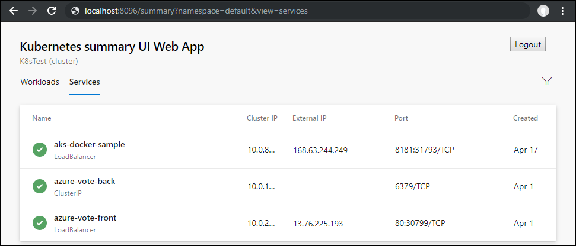

# Azure Pipelines Kubernetes UI

## Overview

This repo contains React based UI view of a kubernetes cluster and will be used in azure devops pipelines. This UI is hostable outside of azure pipelines product and does not require the UI web server to be running inside the kubernetes cluster.

This repo consists of
1. Contracts: The `IKubeService` provides the interface that needs to be implemented inorder to fetch data needed for the UI
2. WebUI: It contains the components that make up the UI

## Usage of Kubernetes UI within Azure DevOps

This Web UI will be integrated into Azure DevOps as an extension and will be available by default in your Azure DevOps accounts going forward. The repo for the extension is at [azPipeline-KubernetesUI-devopsExtension](https://github.com/Microsoft/azPipeline-KubernetesUI-devopsExtension).

## Host the Kubernetes UI within your Web Application

You can also host the UI outside of Azure DevOps. Refer to the [azpipelines-kubernetesUI-WebApp](https://github.com/Microsoft/azpipelines-kubernetesUI-WebApp) repository as a working reference on how to host the Kubernetes UI in a stand-alone web app. It also has a custom implementation of `IKubeService` to fetch the required Kubernets objects.




## Prerequisites: Node and Npm
   
**Windows and Mac OSX**: Download and install node from [nodejs.org](http://nodejs.org/)

**Linux**: Install [using package manager](https://github.com/joyent/node/wiki/Installing-Node.js-via-package-manager)

From a terminal ensure at least node 8.4 and npm 5.3:

```bash
$ node -v && npm -v
v8.4.0
5.3.0
```

To install npm separately:

```
[sudo] npm install npm@5 -g
npm -v
5.6.0
```

Note: On windows if it's still returning npm 2.x run `where npm`. Notice hits in program files. Rename those two npm files and the 5.6.0 in AppData will win.

## Build

    npm install
    npm run build

## Test
To clean test binaries, build test binaries and run tests

    npm run ctest

To build test binaries and run tests

    npm test

## Dependencies

This repository depends on the following packages:

- [azure-devops-ui](https://www.npmjs.com/package/azure-devops-ui): UI library containing the React components used in the Azure DevOps web UI.
- [@kubernetes/client-node](https://github.com/kubernetes-client/javascript): The Javascript clients for Kubernetes implemented in typescript.
- [office-ui-fabric-react](https://github.com/OfficeDev/office-ui-fabric-react): React components for building experiences for Office and Office 365

Some external dependencies:
- `React` - Is used to render the UI in the samples, and is a dependency of `azure-devops-ui`.
- `TypeScript` - Samples are written in TypeScript and complied to JavaScript
- `SASS` - Extension samples are styled using SASS (which is compiled to CSS and delivered in webpack js bundles).
- `webpack` - Is used to gather dependencies into a single javascript bundle for each sample.
- `jest` - Is used as unit test framework.
- `enzyme` - Test utility to test react components.

## Contributing

This project welcomes contributions and suggestions.  Most contributions require you to agree to a
Contributor License Agreement (CLA) declaring that you have the right to, and actually do, grant us
the rights to use your contribution. For details, visit https://cla.microsoft.com.

When you submit a pull request, a CLA-bot will automatically determine whether you need to provide
a CLA and decorate the PR appropriately (e.g., label, comment). Simply follow the instructions
provided by the bot. You will only need to do this once across all repos using our CLA.

This project has adopted the [Microsoft Open Source Code of Conduct](https://opensource.microsoft.com/codeofconduct/).
For more information see the [Code of Conduct FAQ](https://opensource.microsoft.com/codeofconduct/faq/) or
contact [opencode@microsoft.com](mailto:opencode@microsoft.com) with any additional questions or  comments   .
